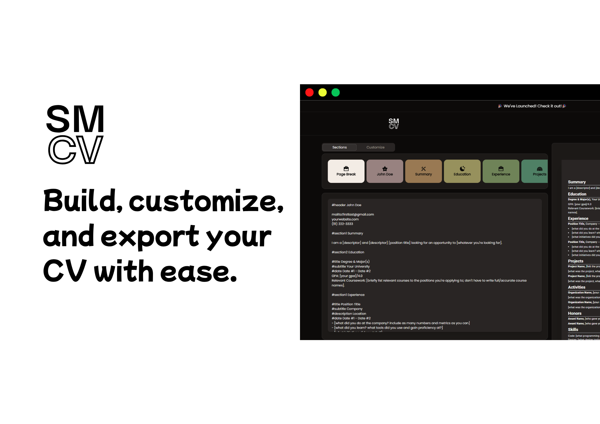

<h1>SmartCV - Resume Builder</h1>

<em>
A free resume builder that simplifies resume creation—just start typing. Instantly turn plain text into a polished, professional CV. Easily customize with a live preview and land your next job faster.</em>

<em>Built with the tools and technologies:</em>

 
 

go try it out at [**smartcv.studio**](https://smartcv.studio).

